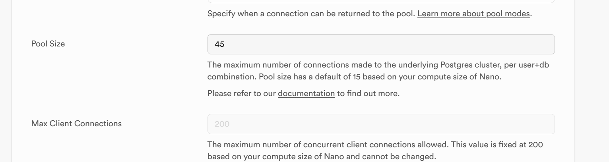
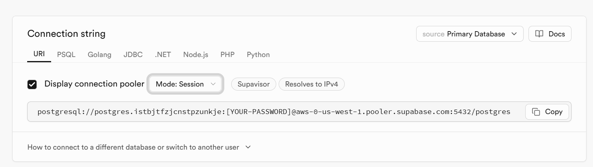

# Supabase Setup Instructions

## Steps

> **Note:** Execute all these SQL commands in your Supabase SQL editor and ensure that they are executed sequentially in the order mentioned below.

1. One Time Setup

Enable following extensions in your supabase project instance (Go to Database -> Extensions -> Search for the extension and click on the extension name to enable it):

- `pg_cron`
- `pg_net`
- `fuzzystrmatch`
- `wrappers`
- `http`

2. Create base tables

- Execute all the queries sequentially in the [02-base-table-creation](./02-base-table-creation/) folder in your SQL editor.

3. Insert data into base tables

- Upload the csv files in the [03-base-table-data-insertion](./03-base-table-data-insertion/) folder to your created `chains` and `token_index` tables.

4. Materialized Views

- Execute all the sql files sequentially in the [04-materialized-views](./04-materialized-views/) folder in your SQL editor.

5. Function Setup

- Execute all the sql files sequentially in the [05-functions](./05-functions/) folder in your SQL editor.

## Supabase Configurations

1. Go to Settings -> Database (Under Configuration) -> Coonefction pooling configuration -> Change Pool Size to "45" from "15" (default)

2. The secret key called "SUPABASE_ROYCO_FRONTEND" that you use in Goldksy, change it to of mode "Session" instead of "Transaction" (default) -- then, delete the exisiting pipeline from Goldsky dashboard and run "./deploy-new-pipelines.sh" to deploy the new pipelines so that the change is triggered.

